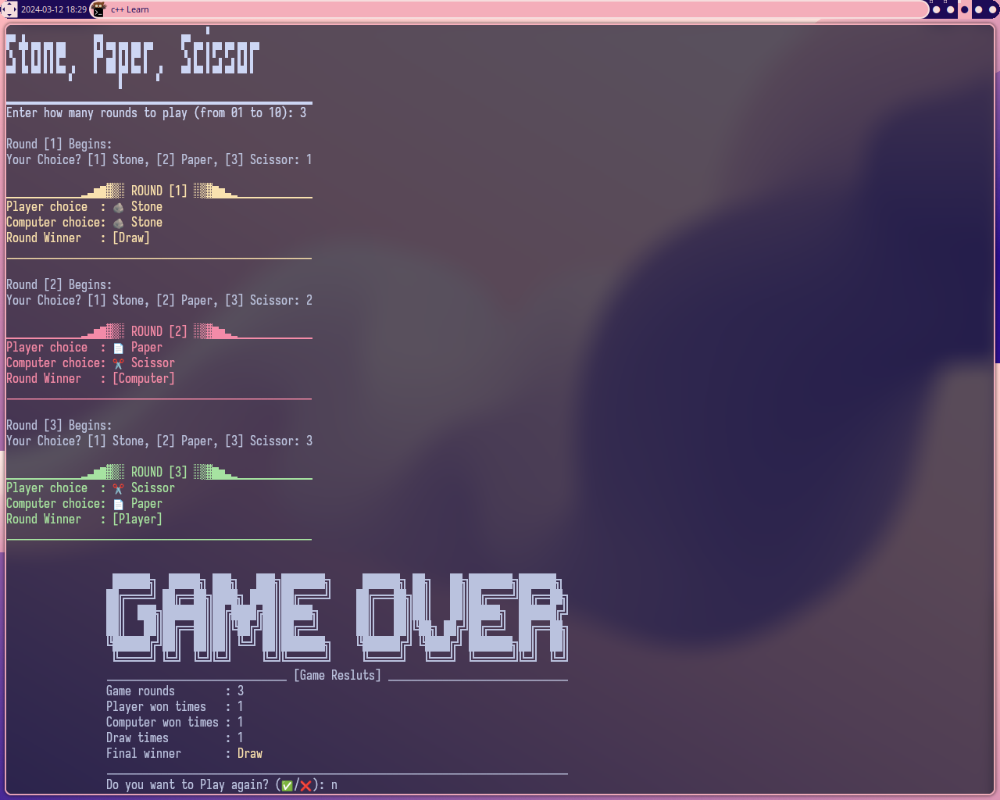

# Stone, Paper, Scissor Game

C++ game, let you play against the computer. Have a lovely TUI :)
NOTE: Tested on Linux only.

---
## How to use
1. Clone this repo.
2. Build the project by running `Make.sh` file.
3. Run the program, use `.\outDebug`.

---
## How to generate the ASCII text?
1. I use a program called [Figlet](http://www.figlet.org/).
2. Install it in your distro.
3. Generate a word.
4. Copy the text from the termail, then paste it in your code file.

---
